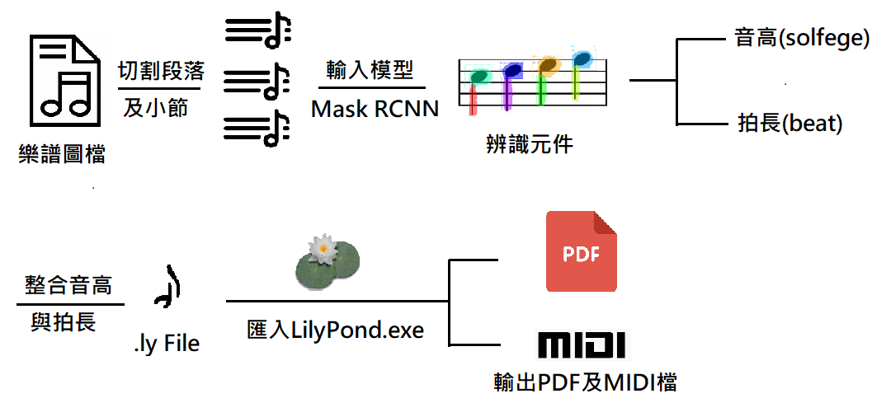

# MSS-music-sheet-scanner-based-on-Mask-RCNN
本作品為樂譜數位典藏的程式，開發平台為 Google-Colab，將樂譜圖片傳入程式，以正交投影從圖片切割出小節，對切割完的小節圖片用 Mask R-CNN 做物件分析，再同樣以正交投影法，以找出音符音高與符號間的關聯性，最終還原成便於保存、編輯的 LilyPond語法格式樂譜，且可以用.midi 檔播放。

# 進行步驟

## 流程圖

## (1)輸入樂譜圖檔
使用者輸入一份欲辨識的圖片檔(JPG、PNG)，為了提高辨識的正確性，該圖片的五線譜須為水平線段。

## (2)切割段落
首先將輸入的圖片二值化，並使用正交投影法，將二值化後的數值投影到 Y 軸加總，如圖(二)；數值較大的範圍即為五線的所在區域(座標)，取得兩個相鄰段落的中點座標，切割出各個段落。

## (3)切割小節
只保留段落圖片中，位於五線內的資訊，其餘刪除，如圖(三 b)所示。並將該圖做正交投影至 X 軸，而小節線所在的 X 座標位置會有最大值，以最大值所在之 X 座標切割，即可切出各個小節，如圖(三 c)所示。

段落圖片原圖

圖(三 b) 只保留五線內的資訊

圖(三 c) 切出各個小節
## (4)輸入 Mask_RCNN 進行辨識
大多樂譜符號可直接辨識，複雜的音符就分成多個部件，後期再由邏輯組合，以方便組合拍長及音高。

## (5)辨識音高
(a)針對小節內做 Y 軸的投影，取出五個值最大的 Y 軸座標，如圖(五)所示。
(b)將記下來的五個座標線性推算出其他 Y 軸位置所屬的音高。
(c)當透過 Mask R-CNN 取得符頭位置座標時，再將其轉化成對應的音高。

## (6)辨識拍長
將 Mask R-CNN 辨識後的結果，輸入到拍長檢測的函式，透過各個元件的 X 座標，檢測元件是否重疊，進而判斷出各元件的拍長。

## (7)即時預覽樂譜
取得檢測樂譜的結果，結合收到的樂符類別與音符拍長，利用 music21的樂譜套件轉換為可在 Google Colab 上及時預覽的樂譜，如圖(八)。

## (8)匯出樂譜.ly 檔及輸出 PDF 與 MIDI
在辨識完各小節的音高及拍長後，合併所有小節的資料，將其轉換為.ly檔並輸出。使用者可將.ly 檔匯入LilyPond，便可取得該樂譜辨識後的PDF文件，圖(九)，及 MIDI 音樂檔，圖(十一)，也可透過 Frescobaldi(註2)，直接對輸出的 ly 檔進行查看或編輯，如圖(十)。

# Mask R-CNN 訓練過程
## (1)訓練流程圖

## (2)標籤製作
運用 VIA (VGG Image Annotator) 進行資料標註，將音符拆分成多個元件，以提高機器學習的成功率，如下圖(十三)。

## (3)開始訓練
經過多次多次調整參數，及不同資料庫訓練後，找出最佳 Loss 的 Weight並輸入模型中。當前最新的資料庫總資料量為 4425 筆，分布如表(一)。

# 實際執行結果
